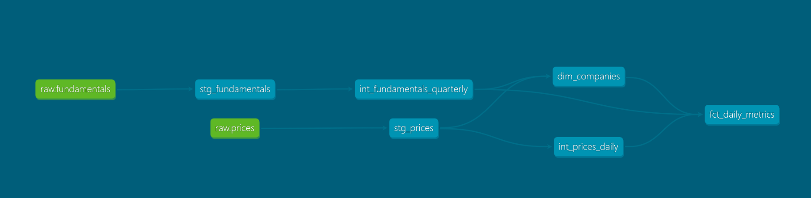
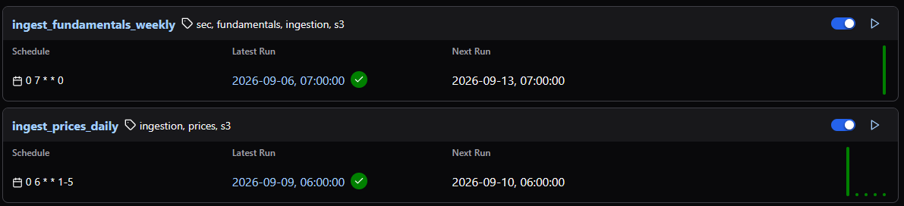
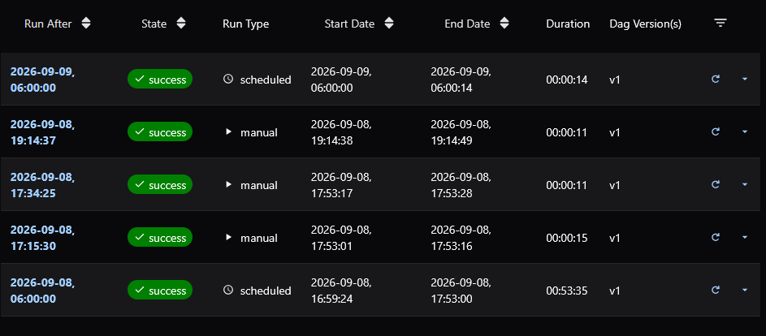
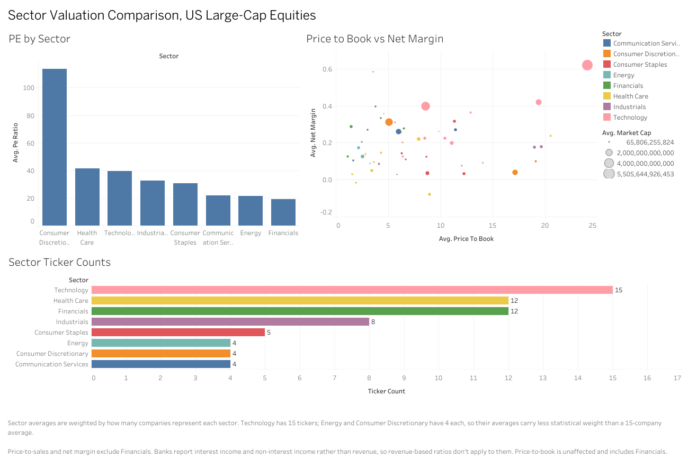

# Market Data Pipeline

A batch pipeline that pulls daily stock prices and quarterly SEC filings,
lands them in S3, loads them into Snowflake, and transforms them with dbt
into a daily fact table with valuation metrics for 64 US large caps.

I built this to practice the modern data stack end to end: orchestration,
infrastructure as code, cloud storage, a warehouse, and transformation
with tests.

## Architecture

```
Yahoo Finance ──┐
                ├──► Airflow (EC2) ──► S3 (Parquet) ──► Snowflake ──► dbt ──► marts
SEC EDGAR ──────┘         │              partitioned      COPY INTO      tests
                          │                                 external
                     2 DAGs, different                      stage
                     schedules
```

**Ingestion.** Two Python scripts. One pulls daily OHLCV, dividends and
split ratios from Yahoo for a fixed 64-ticker universe, the other pulls
XBRL company facts from SEC EDGAR. Both write Parquet to S3.

**Orchestration.** Airflow 3 running in Docker on a t3.medium. Prices run
weekday mornings before the open, fundamentals run Sundays, because SEC
data only changes quarterly and polling it daily would be 64 pointless API
calls. The DAGs stop at S3; `COPY INTO` and `dbt build` are run by hand.

**Storage.** S3 with versioning, encryption, and lifecycle rules. Prices
are partitioned by date (`raw/prices/date=2026-09-03/`), fundamentals are
written as dated snapshots. dbt reads each ticker's newest snapshot, so a
company SEC didn't return one week keeps last week's data.

**Warehouse.** Snowflake, loaded via `COPY INTO` from an external stage.
Snowflake assumes a cross-account IAM role to read the bucket directly,
so no data passes through an intermediate process.

**Transformation.** dbt with staging, intermediate and marts layers.
63 tests: 58 generic, plus 5 singular tests in `dbt/tests/` that check
the output makes sense rather than just its shape.

**Infrastructure.** Terraform manages the S3 bucket, both IAM roles, the
EC2 instance and its security group. `terraform destroy` tears the whole
thing down, which matters when you're running it on trial credits.

### dbt model lineage



(The screenshot predates `int_stock_splits`, `int_market_cap_shares` and
`mart_sector_daily`.)

### Airflow

Both DAGs on their own schedules.



Run history. The scheduled ones fired on their own.



## The decisions that mattered

### Joining fundamentals to prices by filing date

A company's Q2 ends June 30 but doesn't get reported until early August.
If you join fundamentals to prices on period end, every July row gets a
P/E ratio computed from earnings nobody knew about yet. That's lookahead
bias, and it's the reason a lot of backtests look great and then don't
work.

So the join is as-of filing date: for each trading day, take the newest
quarter whose numbers were all filed on or before that day. I used to say
a test asserting `days_since_filing` is never negative proved this. It
didn't, see the first finding below.

### Filtering flow metrics by period duration

SEC reports the same metric over overlapping durations that share an end
date. Q2 alone (Apr–Jun) and the half-year (Jan–Jun) both end June 30.
Sum them without noticing and you roughly double revenue.

Every fundamentals row gets classified by the gap between its start and
end dates: quarterly, half-year, nine-month, annual, or instant for
balance-sheet items that have no duration at all. The buckets are wide
enough for Costco and PepsiCo, whose fiscal quarters run 12, 12, 12 and 16
weeks.

### Prices as traded, share counts as filed

Yahoo adjusts historical prices for splits as of the day you download
them. SEC share counts are as of the day they were filed. Multiply one by
the other without lining them up and market cap is off by the split ratio.
Prices get put back to what they actually traded at, and share counts get
multiplied by any split between their filing and the trade date.

## Things I found by looking at the data

The tests all passed on a version of this where 98% of the valuation
ratios were null, and on a later version where a third of the fact table
carried year-old fundamentals. Tests check what you thought to check.
These came from querying the output and noticing the numbers were wrong;
the queries are in `audit/warehouse_audit.sql`.

The expensive one: ingestion kept whichever filing most recently repeated
a number, and every 10-Q or 10-K restates prior quarters as comparatives,
so the filed date kept drifting forward. Apple's June 2024 quarter ended
up dated August 2025, and on 2025-09-11 the fact table showed $85.8bn of
revenue instead of the real $94.0bn. From October 2025 to May 2026 it was
carrying a 2023 quarter entirely, 37% of rows were over a year stale, and
the staleness test looked fine the whole time because it was computed off
the same wrong dates. Fixed by keeping the first filing of each number
instead of the latest.

Netflix looked like a $50bn company for ten months because Yahoo's price
history is split-adjusted retroactively: its ~$120 September 2025 close
got multiplied by the ~425M pre-split share count still sitting in the
10-Q, and P/E sat around 5. Working out which corporate actions actually
change share count, versus which just move the price (a couple of Yahoo's
"splits" are actually spinoffs), meant comparing cover page counts on
either side of each event.

McDonald's had a market cap of $223,889 at one point, because it files
weighted-average shares in millions and the model read that as a raw
share count. Fixing that properly meant not trusting cover page counts
blindly either: Mastercard's cover page only lists one share class,
122.5M against roughly 876M actually outstanding, and Visa and UPS have
the same problem. A cover count is now only used when a separate us-gaap
count in the same filing agrees with it within 10%. Checked against
Yahoo for all 64 tickers afterward: 61 agree within 0.2%, and the three
that don't are exactly MA, V and UPS.

Banks don't report revenue the way other companies do. Goldman Sachs has
zero revenue rows across 78 quarters, so price-to-sales and net margin
exclude Financials entirely; price-to-book still works for them and
stays populated.

A few smaller things broke too: GE tagged a $2.585bn line for Q4 2015
that isn't actually total revenue, NVDA silently lost two years of
revenue when it switched XBRL tags mid-history, and Costco and PepsiCo's
16-week fourth quarters fell outside the window used to classify filing
periods, so I widened it.

## For the dashboard

`mart_sector_daily` has one row per sector per trading day, built for the
sector comparison. It carries cap-weighted P/E, P/S and P/B (total market
cap over the total of the other side, loss makers included) alongside
medians, and `companies_missing_market_cap` so a sector total that's short
a company is visible instead of looking like a valuation story.

Don't average the per-company ratios. `AVG(pe_ratio)` drops every loss
maker and lets one outlier carry the sector: on the last day of the sample
Consumer Discretionary averaged 103 against a median of 21 and a
cap-weighted 29. Same reason the published dashboard shows ticker counts
next to the sector averages: a 15-company average and a 4-company average
aren't standing on the same footing, and the chart shouldn't imply they are.

**[Live dashboard on Tableau Public](https://public.tableau.com/app/profile/pranav.tripuraneni/viz/Book1_17892343778990/SectorValuationComparisonUSLarge-CapEquities)**



The published version runs off a flat export (`tableau/market_metrics.csv`,
16,000 rows across the 64 tickers) instead of a live Snowflake connection,
since Tableau Public doesn't support one. Financials are excluded from the
P/S and net margin views for the reason above; P/B is unaffected and
includes them. A couple of tickers (MCD, ABBV) show a blank P/B because they
carry negative stockholders' equity, which is an accounting fact about
those companies, not a data gap.

Packaged workbook: [`tableau/sector_valuation_dashboard.twbx`](tableau/sector_valuation_dashboard.twbx)

## Stack

Python, Airflow 3, Docker, AWS (S3, EC2, IAM), Terraform, Snowflake, dbt,
GitHub Actions.

## Layout

```
dags/                 Airflow DAGs
scripts/              ingestion + shared S3 helpers
dbt/models/           staging → intermediate → marts (incl. mart_sector_daily)
dbt/tests/            singular data tests
tests/                DuckDB model run + ingestion unit tests, with fixtures
audit/                queries for checking the warehouse output by hand
terraform/            S3, IAM, EC2, security group, Snowflake integration role
snowflake_setup.sql   warehouse, stage and COPY INTO setup
tableau/              export for the dashboard
.github/              CI
```

## CI

Every push runs Python linting, an Airflow DAG import check, `dbt parse`,
and two things that actually look at the SQL. None of it needs warehouse
credentials.

`dbt parse` resolves refs and Jinja but never reads the SQL, so a model can
be wrong in every way that matters and still pass. So:

- **`sqlfluff parse`** with the Snowflake dialect, which fails on SQL
  Snowflake can't parse. It won't catch a function that exists in another
  warehouse but not Snowflake, so it's a floor rather than a guarantee.
- **`tests/run_models_duckdb.py`**, which builds every model on DuckDB over
  21 tickers of real SEC and Yahoo data in `tests/fixtures/` (335 KB), runs
  the tests declared in the .yml files and in `dbt/tests/`, and then checks
  values with a known right answer: headline revenue for 10 companies,
  market cap across Netflix's split, which quarter each trading day should
  be using, Visa having no market cap, McDonald's having one.
- **`tests/test_ingestion.py`**, unit tests for the extraction rules. The
  fixtures are what ingestion already produced, so they can't cover
  first-filing-wins, form filtering or the largest-tag rule.

Both suites include cases the current fixture doesn't naturally contain (a
fact tagged years late, a cover count covering one share class, a company
missing a quarter), because otherwise reverting those fixes leaves
everything green. I checked that by reverting each fix one at a time: 16 of
16 broke at least one test.

It is not Snowflake. Where the two dialects differ the SQL is rewritten
before running, so this catches logic and value regressions, not dialect
problems.

Locally:

```bash
pip install duckdb pandas pyarrow pyyaml
python tests/test_ingestion.py
python tests/run_models_duckdb.py
```

A full `dbt build` against Snowflake is a separate manually-triggered
job. It's manual because the warehouse runs on trial credits and a
workflow that starts failing when the trial expires would leave a
permanent red X on the repo.

## Known limitations

- Values are as originally reported. Ingestion keeps the first filing of
  each number, so a later restatement is ignored. Around a spinoff,
  quarters before and after sit on different bases, so a TTM figure that
  straddles one mixes both (Honeywell's P/E right after its 2026
  separation includes earnings from the business it spun off).
- SEC's companyfacts API is missing some filings. Citigroup's 2026 10-Qs
  and S&P Global's FY2024 10-K have XBRL but weren't in the API as of
  September 2026, so Citi's fundamentals go stale and S&P Global has no
  TTM for five months.
- Visa has no market cap. It only reports share counts per class, and
  companyfacts leaves out anything broken down by class. GOOGL and META
  have the same cover page problem but fall back to weighted average
  shares, and splits before the loaded price history aren't known, so
  share counts filed more than 400 days before a trade date aren't used.
- Net income is as reported, one-offs included. Alphabet's Q2 2026 10-Q
  tags $112.2bn of net income on $119.8bn of revenue against $40.8bn of
  operating income, so trailing P/E and net margin move with
  non-operating items too.
- Sector mapping is a hardcoded list of 64 tickers rather than pulled
  from SEC or GICS.
- yfinance is an unofficial scraper. It rate limits and breaks when
  Yahoo changes their site.
- Single node deployment: LocalExecutor on one EC2 box, fine for two
  DAGs and 64 tickers, not what you'd run for anything real.

## Running it

Needs an AWS account, a Snowflake account, Terraform, Docker and Python.
Copy `.env.example` to `.env` and fill it in first.

```bash
cd terraform && terraform apply    # provision S3, IAM, EC2
```

Then run `snowflake_setup.sql` section by section to create the
warehouse, storage integration, stages and tables. The storage integration
is a two-pass setup: Terraform creates the IAM role, Snowflake generates
the principal and external ID that go in its trust policy, then Terraform
applies again.

```bash
python scripts/build_ticker_universe.py
python scripts/ingest_prices.py
python scripts/ingest_fundamentals.py
```

Run the `COPY INTO` statements (steps 6 and 7), then:

```bash
cd dbt && dbt deps && dbt build
```

Upgrading a warehouse loaded before September 2026: prices gained new
columns and fundamentals changed which filing they keep, so re-pull both
and follow step 9 of `snowflake_setup.sql` to reload.

For the EC2 deployment, clone onto the instance, drop the local AWS
credentials mount from `docker-compose.yaml` (the instance profile
supplies credentials automatically), and `docker compose up -d`.

### Deployment notes

Things that cost me time on the box and aren't obvious from the docs.

- A t3.small won't run this. 2 GB isn't enough for Airflow 3's four
  services plus a task subprocess; the scheduler goes unhealthy and
  tasks fail with connection refused errors once the box runs out of
  memory. t3.medium (4 GB) is the floor, and the Terraform default.
- Airflow 3 workers talk to the API server over HTTP now instead of
  writing to the database directly, so
  `AIRFLOW__CORE__EXECUTION_API_SERVER_URL` has to point at the
  apiserver container, or the worker resolves to localhost and fails.
- Workers also need a shared `AIRFLOW__API_AUTH__JWT_SECRET`. Without
  it, every container generates its own and the signature never
  verifies, so tasks sit in `queued` forever behind a misleading error
  about the DAG not being found.
- Docker creates missing mount directories as root, so create and chown
  the logs directory before starting, or the dag-processor silently
  fails to write logs and parses nothing:

  ```bash
  mkdir -p logs && sudo chown -R 1000:0 logs
  ```

- Airflow 3 replaced the old user table with SimpleAuthManager, so
  there's no admin/admin login. The generated password is in
  `$AIRFLOW_HOME/simple_auth_manager_passwords.json.generated`:

  ```bash
  docker compose exec apiserver cat /opt/airflow/simple_auth_manager_passwords.json.generated
  ```
